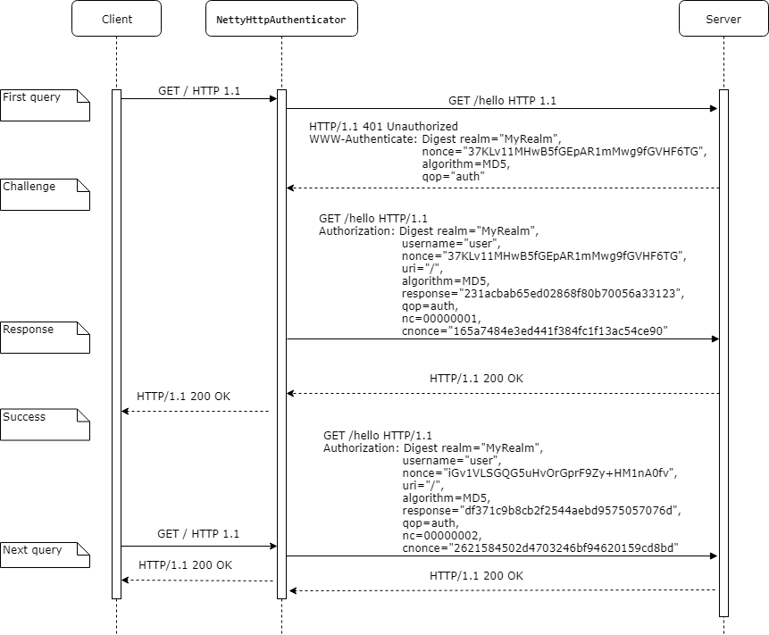

`NettyHttpAuthenticator` is a [Netty](https://github.com/netty/netty) channel handler which helps your handlers
send requests to servers that require authentication.

## Use cases
`NettyHttpAuthenticator` implements basic and digest authentication methods for HTTP and RTSP protocols. 
Digest authentication method supports "none" and "auth" quality of protection (qop) with
`MD5` and `SHA-256` hashing algorithms. It's enough in most cases.


## Getting Started

`NettyHttpAuthenticator` must be initialized with `username` and `password` and placed in a channel pipeline between `HttpObjectAggregator` 
and handler that processes server responses, like this:

```java
Bootstrap b = new Bootstrap();
b.group(group)
 .channel(NioSocketChannel.class)
 .handler(new ChannelInitializer<SocketChannel>() {
     @Override
     protected void initChannel(SocketChannel ch) {
         ChannelPipeline p = ch.pipeline();
         p.addLast(new HttpClientCodec());
         p.addLast(new HttpObjectAggregator(1048576));
         p.addLast(new NettyHttpAuthenticator("scott", "tiger"));
         p.addLast(new HttpClientHandler());
     }
 });
```

### How it works
`NettyHttpAuthenticator` intercepts the client request, and remembers it
* If a server returns the `401 Unathorized` error,  authenticator resends the request with proper authorization header
* If a server returns `200 OK`, authenticator attaches the authorization header to all subsequent requests
* If a server returns the `401 Unathorized` error again, and `stale=false`, authenticator pass that *error* to client (bad credentials)
* If a server returns the `401 Unathorized error` and `stale=true`, authenticator generates a new client nonce and resend the request with new authorization header

Typical client-server exchange may look like this:



### Installing

```
mvn clean install
```


## How to contribute
Make your changes, and submit a pull request. Contributions are welcome!


## License
This project is licensed under the MIT License - see the [LICENSE.md](LICENSE.md) file for details
